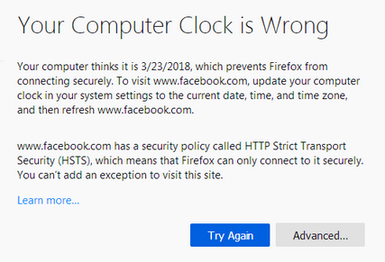

# 

## 网站证书有效期和系统时间不符

** 问题详情 **
```

Your Computer Clock is Wrong

Your computer thinks it is 3/23/2018, which prevents Firefox from 
connecting securely. To visit www.facebookcom, update your computer 
clock in your system settings to the current date, time, and time zone, 
and then refresh www.facebook.com.

www.facebook.com has a security policy called HTTP Strict Transport 
Security (HSTS), which means that Firefox can only connect to it securely. 
You can't add an exception to visit this site.

```
 

** 解決方案 **
```bash
timedatectl | grep Time    # 查看时区
date    # 查看系统时间
sudo hwclock    # 查看硬件时间
date -s "2023-03-23 16:14:10"    # 设置系统时间
sudo hwclock -s    # 同步硬件时间为系统时间
```
